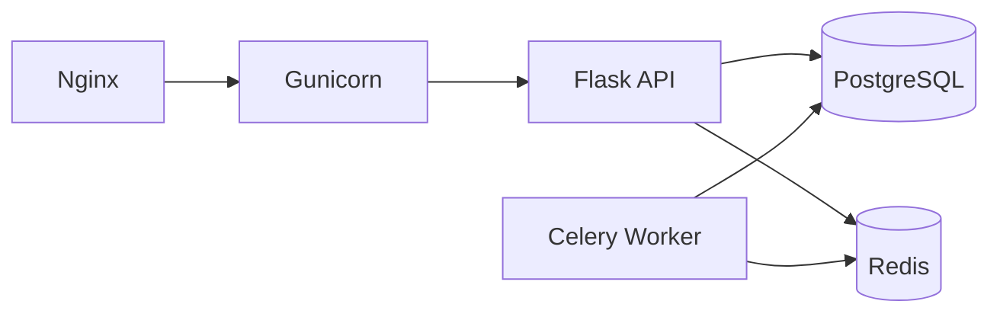

# 部署与运维

## 1. 基础部署结构

推荐采用如下组件部署：

- `nginx`：反向代理
- `gunicorn + flask app`：提供 Web API
- `celery worker`：执行异步任务
- `redis`：消息队列与缓存
- `postgresql + pgvector`：业务与向量数据存储

## 2. 部署示意

## 3. 环境变量

| 变量名 | 说明 |
| --- | --- |
| `DATABASE_URL` | PostgreSQL 连接串 |
| `REDIS_URL` | Redis 连接串 |
| `JWT_SECRET_KEY` | JWT 密钥 |
| `LLM_API_KEY` | LLM API 密钥 |
| `LLM_API_BASE_URL` | LLM API 地址 |
| `LLM_MODEL` | 使用的模型名称 |
| `EMBEDDING_ENABLED` | 是否开启向量功能 |
| `MCP_SERVERS` | 启用的 MCP 服务器列表 |
| `GH_TOKEN` | GitHub OAuth 令牌，用于 Copilot Pro 代理认证 |
| `LLM_COPILOT_KEY` | Copilot Pro 代理的 API Key 占位符 |
| `LLM_COPILOT_BASE_URL` | Copilot Pro 代理地址 |
| `LLM_COPILOT_MODEL` | 通过 Copilot Pro 使用的模型名称 |
| `EMBEDDING_API_URL` | Embedding API 地址 |
| `EMBEDDING_API_KEY` | Embedding API 密钥 |
| `EMBEDDING_MODEL` | Embedding 模型名称 |
| `MAIL_SERVER` | SMTP 服务器地址（默认 `smtp.qq.com`） |
| `MAIL_PORT` | SMTP 端口（默认 `587`） |
| `MAIL_USE_TLS` | 是否启用 TLS（默认 `true`） |
| `MAIL_USERNAME` | SMTP 登录用户名 |
| `MAIL_PASSWORD` | SMTP 登录密码 |
| `MAIL_DEFAULT_SENDER` | 发件人地址 |
| `CORS_ORIGINS` | 允许的跨域来源（默认 `*`） |
| `SOGOU_COOKIES` | 搜狗微信搜索 Cookie |

## 4. 开发建议

系统已进入正常运行阶段，日常开发与维护建议：

1. 在 `backend/app/api/` 下新建蓝图，在 `__init__.py` 中注册
2. 新增数据库字段直接修改模型类，手动执行 `ALTER TABLE` 补齐
3. 使用 `create_audit_log()` 记录关键业务操作
4. 异步耗时任务统一在 `backend/app/tasks/` 中定义
5. 模型 API 密钥等敏感信息放在 `.env` 中（已 gitignore）

详细运维操作（备份、重启、故障排查等）见 [后端运维手册.md](../后端运维手册.md)。
