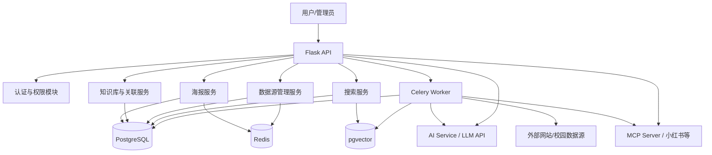

# 项目概述与架构

## 1. 文档目的

本文档用于说明"校园活动信息平台"后端系统的技术方案、模块划分、数据设计、接口设计与部署方式，为后续编码实现、联调测试和课程答辩提供统一依据。

平台目标是围绕校内官方举办的较大型活动，对分散的活动信息进行采集、整理、发布和关联展示，并结合大模型能力实现信息提取、官方来源追溯与智能搜索。

## 2. 项目概述

### 2.1 系统定位

本系统面向校内学生、校级组织、院系管理员等用户，重点服务于校内官方举办、规模较大、数量相对有限但影响范围较广的活动展示需求，提供以下核心能力：

- 活动文本录入并自动生成简约信息海报
- 对活动信息进行结构化提取
- 建立以海报为中心的知识关联图
- 展示官方来源与相关活动联系
- 支持外部数据源抓取和草稿生成
- 支持内部知识库检索与外部扩展搜索

### 2.2 后端设计目标

- 模块清晰，便于课程项目分阶段实现
- 同步接口与异步任务解耦，保证系统可扩展
- 支持传统规则处理与 AI 能力协同工作
- 保证信息来源可追踪、可解释、可审计
- 兼顾开发复杂度与可演示性
- 提供用户留存机制，从"用完即走"转向"持续价值提供"

### 2.3 建设思路与项目意义

传统校园活动系统大多停留在"信息化发布"阶段，主要作用是将通知、公告和活动安排数字化展示出来，但对活动内容本身的结构化理解、关联组织和智能利用仍然较弱。

本项目希望进一步推动校园活动消息从"信息化"迈向"智能化"。其核心思路不是只把活动做成网页或海报，而是把活动消息拆解为可组织、可连接、可检索、可分析的数据对象，使系统呈现出以数据为中心的趋势。

具体来说，这种"数据中心化"体现在以下几个方面：

- 活动信息不再只是静态文本，而是被拆解为时间、地点、主办方、主题、来源等知识节点
- 活动之间不再只是孤立展示，而是能够基于共享节点建立联系，形成可解释的关联网络
- 检索方式不再局限于关键词匹配，而是逐步支持语义理解、外部搜索和信息补全
- 平台价值不再只是"发布消息"，还包括"组织消息、理解消息、连接消息"

因此，本系统不仅是一个校园活动展示平台，也可以看作一个面向校园官方活动场景的轻量级智能信息组织平台。

### 2.4 当前阶段可实现的上层功能

结合当前已经明确的系统边界、知识库设计、搜索方案与 AI 服务集成方式，本项目在第一阶段可以支持以下上层功能：

- **官方大型活动集中展示**：将学校、学院、官方组织发布的较大型活动进行统一汇总和展示，支持活动标题、时间、地点、主办方、简介、来源等核心信息的结构化呈现
- **活动海报自动生成**：根据活动原始文本自动提取关键信息，生成统一风格的简约活动海报或活动详情页内容
- **海报中心式知识关联展示**：以单张活动海报为中心，展示其关联的时间、地点、主办方、主题、来源等知识节点，进一步展示与这些知识节点相关的其他活动，形成可解释的关联网络
- **两级超链接扩展浏览**：用户可以先从海报查看第一层知识节点，再点击知识节点进入详情页或聚合页，查看相关地点、相关主办方、相关日期下的其他活动
- **内部活动智能检索**：支持在平台已有海报和知识节点中进行搜索，第一版可实现关键词检索、全文检索和语义向量检索结合
- **外部活动信息补充搜索**：通过 LLM 驱动的搜索服务和基础爬虫对校内官网、院系网页、专题页、社交媒体等进行外部搜索，将外部结果作为草稿线索或来源补充
- **官方来源追溯与说明**：每条活动信息可展示来源链接或来源页面
- **基于规则的活动关系发现**：可以按同日、同地点、同主办方、同主题等规则自动建立活动间联系
- **AI 增强但可降级运行**：当 LLM 和 MCP 服务可用时实现更强的语义抽取和外部搜索；当 AI 服务不可用时，仍可依靠规则、字典、爬虫和全文检索完成基础功能
- **个人活动日历**：用户可将感兴趣的活动一键导入个人日历（生成 .ics 文件），支持"我的日历"视图
- **个性化订阅与通知**：用户可订阅知识节点，新活动发布时自动匹配并推送通知

## 3. 技术选型

| 层次 | 技术 | 用途 |
| --- | --- | --- |
| Web 框架 | Flask | 提供 REST API |
| WSGI 服务 | Gunicorn | 生产环境部署 Flask |
| 异步任务 | Celery | 执行抓取、语义分析、向量生成等耗时任务 |
| 消息队列/缓存 | Redis | Celery Broker、结果缓存、短期会话缓存 |
| 数据库 | PostgreSQL | 业务主数据库 |
| 向量检索 | pgvector | 存储海报或知识节点 Embedding |
| HTML 解析 | BeautifulSoup | 基础网页抓取与文本抽取 |
| HTTP 调用 | requests | 数据源抓取、调用 LLM API |
| 认证机制 | JWT | 无状态登录鉴权 |
| AI 服务 | LLM API（DeepSeek/OpenAI/Claude 等） | 语义提取、智能搜索、内容增强 |
| MCP 协议 | mcp（Python SDK） | 连接 MCP 服务器（小红书搜索等外部数据源） |

## 4. 总体架构

### 4.1 分层说明

后端系统采用"接口层 + 服务层 + 任务层 + 数据层 + 外部能力层"的分层结构：

1. **接口层**：接收前端请求，完成参数校验、身份认证、统一返回。
2. **服务层**：封装海报生成、知识节点关联、搜索、抓取配置等核心业务逻辑。
3. **任务层**：处理耗时任务，如爬虫抓取、Embedding 计算、AI 调用。
4. **数据层**：负责 PostgreSQL、pgvector、Redis 的数据读写。
5. **外部能力层**：通过 LLM API 和 MCP 协议连接外部 AI 与数据服务。

### 4.2 架构图

