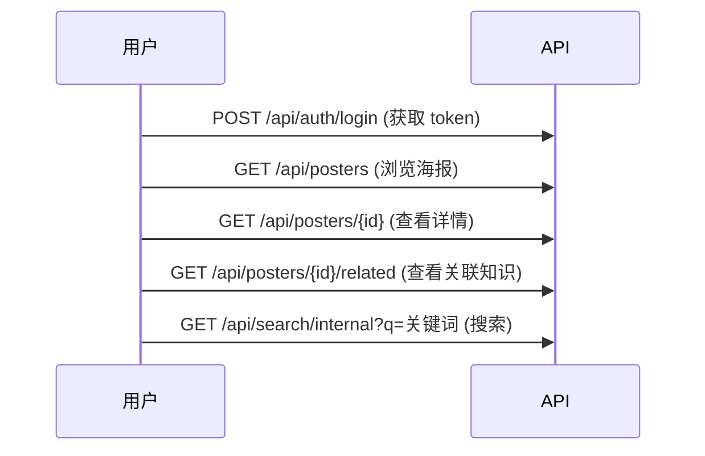
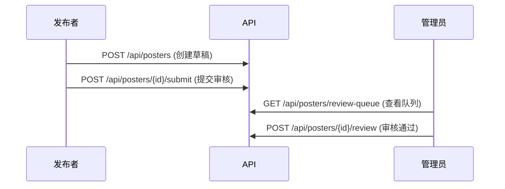

# 交接文档：测试与前端开发

> **日期**：2026-05-20  
> **项目**：校园活动信息平台后端（Campus Activity Information Platform）  
> **状态**：正常运行，已接入真实数据

---

## 一、环境信息

| 项目 | 值 |
|------|-----|
| API 地址 | `http://localhost:5000` |
| 健康检查 | `GET /api/health` |
| 管理员账号 | `admin / admin123456` |
| 演示账号 | 暂无（仅 admin） |

### 容器架构

```
api:5000 (gunicorn + flask)
├── postgres:5432 (数据库)
├── redis:6379 (缓存 + Celery 消息队列)
├── worker (异步任务)
├── beat (定时任务)
└── copilot-proxy:4141 (AI / Embedding 代理)
```

启动：`docker-compose up -d`  
重启 API：`docker-compose restart api`  
查看日志：`docker-compose logs -f api`

---

## 二、核心 API 速查

所有接口（除了 `/api/health` 和 `/api/auth/login`）需要在 Header 中携带 Token：

```
Authorization: Bearer <token>
```

获取 token：

```bash
curl -X POST http://localhost:5000/api/auth/login \
  -H "Content-Type: application/json" \
  -d '{"username":"admin","password":"admin123456"}'
# → {"token": "eyJ...", "user": {...}}
```

### 2.1 海报（Poster）

| 方法 | 路径 | 说明 | 权限 |
|------|------|------|------|
| GET | `/api/posters` | 列表，支持 `?q=&status=&page=&per_page=` | 登录 |
| POST | `/api/posters` | 创建，body `{"raw_text": "..."}` | publisher+ |
| GET | `/api/posters/{id}` | 详情 | 登录 |
| PUT | `/api/posters/{id}` | 更新 | publisher+ |
| POST | `/api/posters/{id}/submit` | 提交审核（draft→pending_review） | publisher+ |
| POST | `/api/posters/{id}/review` | 审核通过/驳回 | admin |
| GET | `/api/posters/review-queue` | 审核队列，支持 `?status=&sort_by=` | admin |
| POST | `/api/posters/bulk-review` | 批量审核 | admin |
| GET | `/api/posters/{id}/related` | 关联知识节点 | 登录 |
| GET | `/api/posters/{id}/duplicates` | 查看重复 | admin |
| POST | `/api/posters/{id}/merge-source` | 合并来源 | admin |
| POST | `/api/posters/{id}/rebuild-knowledge` | 重建知识节点 | admin |
| POST | `/api/posters/{id}/ai-enrich` | AI 增强提取 | admin |

### 2.2 搜索

| 方法 | 路径 | 说明 |
|------|------|------|
| GET | `/api/search/internal?q=关键词` | 内部搜索（向量+全文） |
| GET | `/api/search/external?q=关键词` | 外部搜索（通过 LLM） |

响应格式：

```json
{
  "search_mode": "vector",    // 或 "fulltext"
  "items": [
    {
      "hit_type": "poster",
      "item": { ... poster 对象 ... },
      "score": 0.85
    }
  ],
  "total": 7
}
```

### 2.3 知识节点

| 方法 | 路径 | 说明 |
|------|------|------|
| GET | `/api/knowledge/nodes` | 列表 |
| GET | `/api/knowledge/nodes/{id}` | 详情 |
| POST | `/api/knowledge/rebuild` | 重建全部（可选 `rebuild_embeddings`） |

### 2.4 数据源与爬虫

| 方法 | 路径 | 说明 |
|------|------|------|
| GET | `/api/data-sources` | 列表 |
| POST | `/api/data-sources` | 创建 |
| GET | `/api/data-sources/{id}` | 详情 |
| PUT | `/api/data-sources/{id}` | 更新 |
| POST | `/api/data-sources/{id}/crawl` | 触发爬取（加 `?sync=true` 同步执行） |
| GET | `/api/data-sources/{id}/logs` | 爬虫日志 |

### 2.5 AI 服务

| 方法 | 路径 | 说明 |
|------|------|------|
| GET | `/api/ai/status` | 状态（LLM 是否配置） |
| POST | `/api/ai/extract` | 从文本提取结构化信息 |
| POST | `/api/ai/enrich/{poster_id}` | 增强海报提取标签/摘要 |
| POST | `/api/ai/search` | AI 驱动的搜索 |
| GET | `/api/ai/mcp/servers` | MCP 服务器列表 |
| POST | `/api/ai/mcp/call` | 调用 MCP 工具 |

### 2.6 系统

| 方法 | 路径 | 说明 |
|------|------|------|
| GET | `/api/health` | 健康检查（无需认证） |
| GET | `/api/tasks/{task_id}` | 异步任务状态 |
| GET | `/api/audit-logs` | 审计日志（admin） |
| GET | `/api/export/posters.json` | 导出全部海报 |
| GET | `/api/export/knowledge.json` | 导出知识节点 |
| GET | `/api/export/crawl-report.json` | 导出爬虫日志 |
| GET | `/api/demo/summary` | 平台统计概览 |

### 2.7 字典（受控词表）

| 方法 | 路径 | 说明 |
|------|------|------|
| GET | `/api/dict/{category}` | 查某类词表 |
| POST | `/api/dict/{category}` | 新增词条 |
| PUT | `/api/dict/{category}/{id}` | 更新词条 |
| DELETE | `/api/dict/{category}/{id}` | 删除词条 |
| POST | `/api/dict/seed` | 植入预设数据（admin） |

---

## 三、当前数据状态

### 3.1 已发表海报（11 条）

可作为前端展示的测试数据：

| ID | 标题 | 内容特点 |
|----|------|---------|
| 10 | 中山大学附属第五医院生物医学新技术与细胞治疗中心揭牌成立 | 医疗科研，含图片 |
| 11 | 第四届中国汽车工程学会博士生学术论坛 | 学术论坛 |
| 12 | 大湾区生物医药未来产业创新中心在穗成立 | 产业新闻 |
| 13 | 中山大学外国语学院院史馆正式启用 | 校园文化 |
| 14 | 鸿蒙专家做客中山大学，与师生畅谈万物互联 | 技术讲座 |
| 15 | 中山大学 PhyAgentOS 获国际AI赛事采用 | AI / 科技 |
| 1,3-6 | 科技节、春季运动会、歌手大赛、AI讲座 | 演示数据，含 event_time/location/organizer |

### 3.2 待审核草稿（16 条）

主要在审核队列中，可测试审核流程：

- 新闻 3 条（一线动态）
- 药学院讲座 12 条（含结构化字段：时间、地点、主讲人）
- 手动创建 1 条

### 3.3 数据源

| ID | 名称 | 频率 |
|----|------|------|
| 1 | 中山大学新闻网-一线动态 | 3s 间隔 |
| 2 | 中山大学药学院-学术讲座 | 3s 间隔 |

---

## 四、测试指南

### 4.1 正常浏览流程



### 4.2 发布流程



### 4.3 向量搜索验证

用以下查询测试语义搜索效果：

| 查询词 | 预期结果 | 说明 |
|--------|---------|------|
| `鸿蒙专家` | 直接匹配「鸿蒙专家做客中山大学」 | 精确匹配 |
| `计算机技术` | AI讲座排前 | 零关键词重叠，靠向量语义 |
| `学术讲座` | 各种讲座类内容 | 广义匹配 |

对比：搜索 `?q=xxx` 时，响应中 `search_mode` 标识当前是 `vector` 还是 `fulltext`。

### 4.4 AI 功能测试前提

AI 增强需要 DeepSeek API 可用（当前配置了 `sk-65f2...` 的 key）。如果 LLM 不可用，AI 接口会返回错误但不影响其他功能。

### 4.5 测试已知限制

- `activity_types` 字典为空，需要 `POST /api/dict/seed` 植入或手动添加
- 爬虫需要目标网站可达（从部署服务器能访问 `sysu.edu.cn`）
- 向量搜索要求已构建 embedding（当前已全部构建完毕）

---

## 五、Poster 对象字段说明

前端最常用的字段：

```json
{
  "id": 14,
  "title": "鸿蒙专家做客中山大学",
  "summary": "5月7日，深圳开鸿数字产业发展有限公司...",
  "content_html": "<div class=\"activity-poster\">\n  <h2>...</h2>\n  ...</div>",
  "raw_text": "中大新闻网讯...",
  "status": "published",           // draft / pending_review / published / rejected
  "source_type": "crawl",          // manual / crawl
  "source_url": "https://...",
  "event_time": "2026-06-10T14:00:00",
  "location": "药学院615会议室",
  "organizer": "中山大学药学院",
  "activity_type": "学术讲座",
  "tags": "AI,鸿蒙,万物互联",
  "quality_score": 85,
  "created_at": "2026-05-20T...",
  "created_by": 1,
  "review_comment": null
}
```

`content_html` 是已经渲染好的 HTML 片段，前端直接插入即可显示。

---

## 六、常见问题

### 6.1 容器重启后数据是否丢失？

不会。`postgres-data` 和 `redis-data` 是命名数据卷，`docker-compose down` / `up` 不丢失。

### 6.2 Token 过期怎么办？

默认 JWT 有效期 15 分钟。重新 `POST /api/auth/login` 获取新 token。

### 6.3 想重置数据库？

```bash
docker-compose down -v   # 删除所有数据卷（数据全丢！）
docker-compose up -d
docker exec campus-activity-api flask seed-demo  # 植入演示数据
```

### 6.4 如何查看当前所有 API 路由？

```bash
docker exec -i campus-activity-api python -c "
from app import create_app
app = create_app()
for rule in sorted(app.url_map._rules, key=lambda r: r.rule):
    methods = ','.join(sorted(rule.methods - {'OPTIONS','HEAD'}))
    if methods:
        print(f'{methods:8s} {rule.rule}')
"
```

### 6.5 搜索为什么搜不到某些内容？

- 检查海报的 `status`（search 只优先 published，非 published 可能排在很后）
- 确认 embedding 已构建（`POST /api/knowledge/rebuild` 加 `rebuild_embeddings: true`）
- 检查 `EMBEDDING_ENABLED=true`

---

## 七、相关文档

| 文档 | 位置 | 适合谁 |
|------|------|--------|
| 后端技术文档 | `docs/后端技术文档.md` | 全面了解架构和 API |
| 后端运维手册 | `docs/后端运维手册.md` | 部署和运维操作 |
| 向量搜索测试 | `docs/tests/vector_search_test.md` | 搜索功能验收 |
| 差距分析（已归档） | `docs/todos/TODOList.md` | 开发历程记录 |
