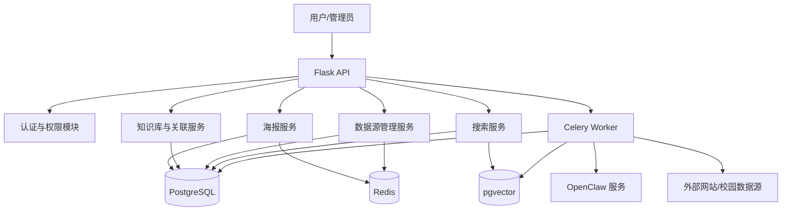
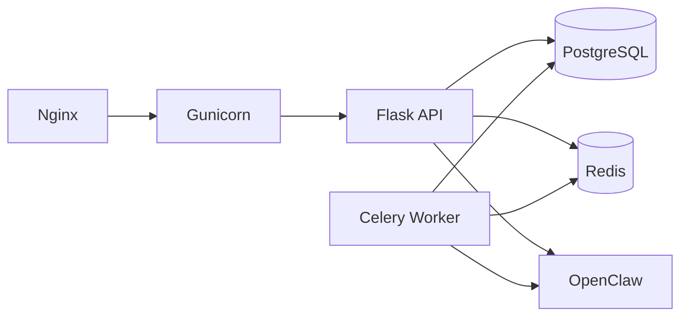

# 校园活动信息平台后端技术文档

## 1. 文档目的

本文档用于说明“校园活动信息平台”后端系统的技术方案、模块划分、数据设计、接口设计与部署方式，为后续编码实现、联调测试和课程答辩提供统一依据。

平台目标是围绕校内官方举办的较大型活动，对分散的活动信息进行采集、整理、发布和关联展示，并结合大模型能力实现信息提取、官方来源追溯与智能搜索。

## 2. 项目概述

### 2.1 系统定位

本系统面向校内学生、校级组织、院系管理员等用户，重点服务于校内官方举办、规模较大、数量相对有限但影响范围较广的活动展示需求，提供以下核心能力：

- 活动文本录入并自动生成简约信息海报
- 对活动信息进行结构化提取
- 建立以海报为中心的知识关联图
- 展示官方来源与相关活动联系
- 支持外部数据源抓取和草稿生成
- 支持内部知识库检索与外部扩展搜索

### 2.2 后端设计目标

- 模块清晰，便于课程项目分阶段实现
- 同步接口与异步任务解耦，保证系统可扩展
- 支持传统规则处理与 AI 能力协同工作
- 保证信息来源可追踪、可解释、可审计
- 兼顾开发复杂度与可演示性

### 2.3 建设思路与项目意义

传统校园活动系统大多停留在“信息化发布”阶段，主要作用是将通知、公告和活动安排数字化展示出来，但对活动内容本身的结构化理解、关联组织和智能利用仍然较弱。

本项目希望进一步推动校园活动消息从“信息化”迈向“智能化”。其核心思路不是只把活动做成网页或海报，而是把活动消息拆解为可组织、可连接、可检索、可分析的数据对象，使系统呈现出以数据为中心的趋势。

具体来说，这种“数据中心化”体现在以下几个方面：

- 活动信息不再只是静态文本，而是被拆解为时间、地点、主办方、主题、来源等知识节点
- 活动之间不再只是孤立展示，而是能够基于共享节点建立联系，形成可解释的关联网络
- 检索方式不再局限于关键词匹配，而是逐步支持语义理解、外部搜索和信息补全
- 平台价值不再只是“发布消息”，还包括“组织消息、理解消息、连接消息”

因此，本系统不仅是一个校园活动展示平台，也可以看作一个面向校园官方活动场景的轻量级智能信息组织平台。

### 2.4 当前阶段可实现的上层功能

结合当前已经明确的系统边界、知识库设计、搜索方案与 OpenClaw 集成方式，本项目在第一阶段可以支持以下上层功能：

- 官方大型活动集中展示
  - 将学校、学院、官方组织发布的较大型活动进行统一汇总和展示
  - 支持活动标题、时间、地点、主办方、简介、来源等核心信息的结构化呈现
- 活动海报自动生成
  - 根据活动原始文本自动提取关键信息
  - 生成统一风格的简约活动海报或活动详情页内容
- 海报中心式知识关联展示
  - 以单张活动海报为中心，展示其关联的时间、地点、主办方、主题、来源等知识节点
  - 进一步展示与这些知识节点相关的其他活动，形成可解释的关联网络
- 两级超链接扩展浏览
  - 用户可以先从海报查看第一层知识节点
  - 再点击知识节点进入详情页或聚合页，查看相关地点、相关主办方、相关日期下的其他活动
- 内部活动智能检索
  - 支持在平台已有海报和知识节点中进行搜索
  - 第一版可实现关键词检索、全文检索和语义向量检索结合
- 外部活动信息补充搜索
  - 通过 OpenClaw Skill 和基础爬虫对校内官网、院系网页、专题页等进行外部搜索
  - 将外部结果作为草稿线索或来源补充，而不是直接无审核发布
- 官方来源追溯与说明
  - 每条活动信息可展示来源链接或来源页面
  - 便于用户确认活动信息是否来自官方渠道
- 基于规则的活动关系发现
  - 可以按同日、同地点、同主办方、同主题等规则自动建立活动间联系
  - 适合作为第一版“智能关联”功能的基础实现
- AI 增强但可降级运行
  - 当 OpenClaw 和模型服务可用时，系统可实现更强的语义抽取、外部搜索和复杂页面处理
  - 当 AI 服务不可用时，系统仍可依靠规则、字典、爬虫和全文检索完成基础功能

从产品层面看，当前阶段本项目已经不仅能够“展示活动”，还能够初步实现：

- 对活动信息的结构化组织
- 对活动之间关系的可解释展示
- 对官方来源的追溯
- 对内部与外部信息的联合检索

因此，第一版系统的上层能力可以概括为“官方活动展示 + 知识关联浏览 + 基础智能检索 + 外部信息补充”。

## 3. 技术选型

| 层次 | 技术 | 用途 |
| --- | --- | --- |
| Web 框架 | Flask | 提供 REST API |
| WSGI 服务 | Gunicorn | 生产环境部署 Flask |
| 异步任务 | Celery | 执行抓取、语义分析、向量生成等耗时任务 |
| 消息队列/缓存 | Redis | Celery Broker、结果缓存、短期会话缓存 |
| 数据库 | PostgreSQL | 业务主数据库 |
| 向量检索 | pgvector | 存储海报或知识节点 Embedding |
| HTML 解析 | BeautifulSoup | 基础网页抓取与文本抽取 |
| HTTP 调用 | requests | 数据源抓取、调用 OpenClaw |
| 认证机制 | JWT | 无状态登录鉴权 |
| AI 服务 | OpenClaw | 语义提取、智能搜索、复杂网页处理 |

## 4. 总体架构

### 4.1 分层说明

后端系统采用“接口层 + 服务层 + 任务层 + 数据层 + 外部能力层”的分层结构：

1. 接口层：接收前端请求，完成参数校验、身份认证、统一返回。
2. 服务层：封装海报生成、知识节点关联、搜索、抓取配置等核心业务逻辑。
3. 任务层：处理耗时任务，如爬虫抓取、Embedding 计算、AI 调用。
4. 数据层：负责 PostgreSQL、pgvector、Redis 的数据读写。
5. 外部能力层：通过 OpenClaw 和目标网页提供 AI 与外部搜索支持。

### 4.2 架构图



## 5. 模块设计

## 5.1 认证与权限模块

### 功能职责

- 用户登录
- JWT 签发与校验
- 基于角色的访问控制

### 角色定义

- `viewer`：查看活动、搜索、浏览关联信息
- `publisher`：创建和编辑海报草稿，提交发布审核
- `admin`：管理数据源、用户、抓取任务和审核发布

### 实现方式

- 在 Flask 中使用 `auth` 蓝图统一处理登录和鉴权
- 登录成功后返回 Access Token
- 通过装饰器实现接口级权限控制

## 5.2 海报管理模块

### 功能职责

- 创建活动海报草稿
- 对输入文本进行关键信息提取
- 生成简约 HTML 海报
- 保存和发布海报

### 处理流程

1. 用户提交活动原始文本
2. 系统抽取标题、时间、地点、主办方、简介等字段
3. 生成结构化数据与简约海报 HTML
4. 存储为草稿状态
5. 用户确认后提交审核
6. 管理员审核海报内容
7. 审核通过后自动匹配相关知识节点并建立关联，发布上线
8. 审核不通过则退回并附修改意见，用户修改后可重新提交

### 说明

- 第一阶段可使用规则和正则表达式提取信息
- 第二阶段可引入 OpenClaw 的语义抽取能力，提高复杂文本解析效果

## 5.3 知识库与知识节点模块

### 功能职责

- 管理平台中的知识节点信息
- 为活动提供结构化关联对象
- 支持海报中心式关联图展示

### 知识节点类型示例

- 时间节点：日期、时间段、学期阶段
- 地点节点：校区、建筑、会场
- 组织节点：学校、学院、部门、主办单位
- 主题节点：讲座、晚会、竞赛、论坛
- 对象节点：面向人群、报名对象
- 来源节点：官网栏目、通知页面、专题页

### 知识节点生成机制

知识节点的生成不建议完全依赖大字典，也不建议完全依赖 AI 自动发现。当前版本推荐采用“类型预定义 + 字典标准化 + 规则抽取 + AI 增强”的组合方式。

1. 类型预定义：先由系统设计阶段人工定义知识节点类型，例如时间、地点、组织、主题、对象、来源等。这一步属于领域建模，目的是明确平台希望用哪些维度描述一张官方活动海报。
2. 实例抽取：系统运行时从海报文本、抓取网页、录入表单中提取具体节点实例。例如“2026-05-10 19:00”属于时间节点，“大学生活动中心大礼堂”属于地点节点，“校团委”属于组织节点。
3. 字典标准化：对地点、组织、活动专题等高频字段维护小型受控词表和别名表，用于统一名称。例如将“大活礼堂”统一为“大学生活动中心大礼堂”，将“校团委”与“共青团委员会”归并到同一节点。
4. 规则建边：海报与知识节点之间的关系，以及海报与海报之间的关系，优先依据共享节点和明确规则生成，而不是完全依赖语义猜测。
5. AI 增强：对规则难以处理的复杂文本，使用 OpenClaw 或大模型补充识别，例如发现新的活动主题、识别系列活动归属、补全隐含主办方等。

### 字典与规则的使用建议

当前课程项目不建议维护过大的自由文本字典，而是维护少量稳定、可解释的受控词表：

- 地点字典：校区、楼宇、礼堂、报告厅、活动中心等
- 组织字典：学校部门、学院、官方组织、主办单位等
- 主题标签表：科技节、招聘会、讲座、论坛、竞赛等
- 来源字典：学校官网、学院官网、专题栏目、活动通知页等

这些字典的主要作用不是“决定所有关系”，而是：

- 统一命名
- 处理别名
- 提高抽取准确率
- 为后续关系生成提供稳定节点

### 关系知识点选取原则

关系知识点应优先选择高频、稳定、容易结构化、能直接解释活动联系的字段。当前版本推荐优先使用以下知识点建立关系：

- 时间
- 地点
- 主办方
- 活动主题
- 来源

选择这些知识点的原因是：

- 容易从官方活动文本中抽取
- 适合作为海报之间建立联系的依据
- 前端展示和课程答辩时更容易解释

### 关系生成示例

可先采用有限规则生成关系，例如：

- 若两张海报活动日期相同，则建立 `same_day`
- 若两张海报地点相同，则建立 `same_place`
- 若两张海报主办方相同，则建立 `same_org`
- 若两张海报主题标签相同，则建立 `same_topic`

这种方案比完全依赖语义自动连线更稳定，也更适合作为课程项目的第一版实现。

### 设计原则

- 当前知识库采用“海报为中心、周围知识节点辐射展开”的结构，视觉上接近菊花图
- 一张海报可以连接多个知识节点，例如时间、地点、主办方、活动类型、报名对象等
- 海报与海报之间也可以建立关系，例如同一时间段、同一地点、同一主办方、同一主题
- 在直接关联节点之外，再提供一层可点击的扩展链接，用于展示节点详情和节点关联内容
- 当前版本以官方活动为主，默认来源可信，因此不把置信度作为核心业务字段
- 置信度与权威评分保留为未来扩展能力，用于后续接入非官方认证信息时再启用

### 两级超链接模型

为兼顾信息丰富度和界面可读性，推荐采用“两级超链接关联模型”：

1. 一级关联：海报直接连接时间、地点、主办方、主题、来源等知识节点。
2. 二级扩展：点击某个知识节点后，进入该节点详情页或聚合页，继续查看该节点的扩展信息和关联海报。

该模型的核心思想是：

- 第一层负责回答“这张海报包含什么关键信息”
- 第二层负责回答“这些关键信息还能延伸出什么内容”
- 当前课程项目建议控制在两层，不继续无限展开，避免前后端复杂度快速上升

### 两级超链接示例

以“2026 校园科技文化节开幕式”海报为例：

- 一级关联节点：
  - 时间：`2026-05-10 19:00`
  - 地点：`大学生活动中心大礼堂`
  - 主办方：`校团委`
  - 类型：`开幕式`
  - 来源：`学校官网通知`

- 二级扩展链接：
  - 点击“地点：大学生活动中心大礼堂”
    - 查看该地点详情
    - 查看该地点举办过的其他活动
    - 查看该地点所属建筑或校区
  - 点击“主办方：校团委”
    - 查看主办方详情
    - 查看该主办方历史活动
    - 查看相关专题活动
  - 点击“时间：2026-05-10”
    - 查看当天活动聚合页
    - 查看同一时间段的其他大型活动

## 5.4 关联信息展示模块

### 功能职责

- 展示当前海报的直接关联知识节点
- 展示与这些节点相关的其他海报
- 展示海报之间的关联原因与官方来源

### 关联逻辑

- 一级关联：当前海报直接连接的知识节点
- 二级关联：与这些知识节点共享关系的其他海报
- 海报间关系：可按时间、地点、主办方、主题等维度建立链接
- 当前版本优先返回明确的结构化关联，不强调置信度评分排序

### 设计目标

本模块不是“推荐系统”，而是“可解释的官方活动关联展示系统”，重点强调：

- 为什么相关
- 信息来自哪里
- 关联路径是什么

### 图结构建议

推荐采用两类边：

- 海报到知识节点：如“活动 A -> 地点:大学生活动中心”
- 海报到海报：如“活动 A -> 活动 B”，关系类型可为“同日举办”“同地点举办”“同主办方”“同主题”

在前端展示上，还可为知识节点增加“节点详情跳转边”，即：

- 海报 -> 知识节点：用于说明当前海报本身
- 知识节点 -> 节点详情页/聚合页：用于进入第二层超链接内容

## 5.5 搜索模块

### 功能职责

- 提供内部知识库检索
- 提供外部扩展搜索
- 统一返回可用于展示和入库的搜索结果

### 搜索结构

1. 内部搜索：在平台已有海报和知识节点中检索，优先采用语义向量检索，可辅以 PostgreSQL 全文检索作为补充。
2. 外部搜索：调用 OpenClaw 的搜索类 Skill，并结合平台爬虫，从校内官网、院系页面、专题页等外部来源获取信息。

### 检索策略

- 内部搜索面向“平台内已有知识”的快速定位
- 外部搜索面向“平台外新增信息”的发现、验证和草稿补全
- 当前版本建议将内部搜索与外部搜索分开展示，避免结果语义混淆
- 后续可扩展为统一搜索入口，再按来源分组展示

## 5.6 数据源与爬虫模块

### 功能职责

- 配置外部信息来源
- 执行定时或手动抓取
- 抓取网页并生成活动草稿
- 记录抓取日志
- 为外部搜索提供可控的数据补充能力

### 支持的数据源

- 学校官网通知页
- 学院新闻页
- 社团公众号转存页
- 校内活动发布页面

### 实现策略

- 使用 `data_sources` 表记录抓取规则和启用状态
- Celery Worker 异步执行抓取任务
- 基础模式采用 `requests + BeautifulSoup`
- 复杂网页可转由 OpenClaw 的网页技能处理
- 外部搜索结果可先进入草稿区，再由管理员确认是否入库

## 5.7 OpenClaw 集成模块

### 功能职责

- 调用外部 AI 服务完成语义分析
- 调用搜索或浏览器自动化技能
- 提供复杂网页提取和智能信息补全能力
- 统一管理外部 AI 工具的权限、资源与配置

### 适用场景

- 活动文本语义抽取
- 外部站点搜索
- 动态页面内容处理
- 复杂页面结构解析

### 集成方式

- Flask 后端通过 HTTP API 调用 OpenClaw
- 服务层封装统一客户端，避免业务代码直接依赖远程接口细节
- 对调用结果进行统一超时、重试和日志记录

### 安全与运行约束

- OpenClaw 不直接暴露给普通前端用户，只允许后端服务或管理员任务调用
- 为可调用的 Skill 建立白名单，禁止任意工具自由执行
- 对不同 Skill 配置独立超时、并发数和最大返回长度
- 对浏览器自动化、外部网络访问设置域名范围和操作范围限制
- 任务调用采用最小权限原则，区分只读搜索、内容提取、后台管理等权限级别
- 对 API Key、Cookie、账号凭证统一使用服务端密钥管理，不写入业务表
- 对高内存任务设置单任务内存上限、队列隔离和失败回收策略
- 所有 OpenClaw 调用记录任务来源、参数摘要、执行时长和结果状态，便于审计

### 内部工具配置建议

- 建立 OpenClaw 工具配置表，记录工具名称、启用状态、权限级别、超时设置、可访问域名和负责人
- 仅管理员可修改 Skill 配置和外部连接参数
- 对实验性 Skill 和生产 Skill 分环境管理，避免调试配置影响正式运行

### 可接入平台与能力范围建议

结合 OpenClaw 的 Skill、Tool 和 Plugin 机制，本项目理论上可以接入多类外部平台，包括消息协作平台、搜索平台、网页抓取平台和浏览器自动化能力。但考虑到本项目当前聚焦“校内官方大型活动”场景，接入范围应优先围绕官方信息源，而不是盲目追求平台数量。

建议按以下优先级规划：

1. 第一优先级：学校官网、学院官网、专题活动页、通知公告页。这些来源最稳定、最符合“官方活动展示”定位，优先通过基础爬虫和可控规则接入。
2. 第二优先级：需要搜索或浏览器操作才能稳定获取信息的校内页面，可通过 OpenClaw 的搜索类 Skill、网页获取工具和浏览器自动化能力接入。
3. 第三优先级：若学校实际通知链路依赖协作平台，再考虑接入企业微信、飞书、钉钉、QQ Bot 等外部消息平台，但这一层不建议作为课程项目第一阶段的核心能力。

从平台类型角度看，OpenClaw 更适合在本项目中承担以下能力：

- 外部网页搜索：补充站外活动线索和来源链接
- 网页内容抓取：处理结构复杂或动态加载页面
- 浏览器自动化：应对普通爬虫难以处理的页面流程
- 协作渠道接入：在确有校园通知场景需要时接入企业微信、飞书、钉钉、QQ Bot 等渠道

因此，本项目应坚持“官方网页优先、搜索能力补充、协作平台按需接入”的原则。

### AI 参与模块的非 AI 基础实现

本项目虽然引入 OpenClaw 和大模型能力，但整体设计应遵循“AI 增强，而不是 AI 依赖”的原则。也就是说，AI 用于提高抽取效果、搜索广度和复杂页面处理能力，但系统的基础功能不能完全依赖 AI 服务是否可用。

建议为所有 AI 参与模块预留对应的非 AI 基础实现：

- 海报信息抽取
  - AI 实现：利用 OpenClaw 或大模型识别标题、时间、地点、主办方、活动简介
  - 非 AI 实现：通过正则表达式、表单字段和关键词规则进行抽取
- 知识节点生成
  - AI 实现：识别隐含主题、系列活动归属和复杂上下文
  - 非 AI 实现：依靠预定义类型、字典标准化和规则匹配生成节点
- 海报关系生成
  - AI 实现：根据语义判断潜在活动联系
  - 非 AI 实现：基于 `same_day`、`same_place`、`same_org`、`same_topic` 等规则建边
- 内部搜索
  - AI 实现：向量语义检索
  - 非 AI 实现：PostgreSQL 全文检索、标签过滤和字段检索
- 外部搜索
  - AI 实现：OpenClaw 搜索类 Skill、浏览器自动化、内容提取
  - 非 AI 实现：预设数据源爬虫、固定来源列表和管理员手动录入
- 网页内容解析
  - AI 实现：复杂页面理解、摘要提取、结构识别
  - 非 AI 实现：`requests + BeautifulSoup + CSS Selector` 抽取

### 兜底设计的意义

为 AI 模块保留非 AI 实现的意义主要有以下几点：

- 当 OpenClaw 服务异常、超时或不可用时，系统仍可完成基础活动发布和查询
- 当外部网页结构稳定时，规则和字典方案通常更容易解释、调试和维护
- 在课程项目答辩中，这种设计更能体现系统工程思维，而不是单纯依赖模型能力
- 后续即使更换 AI 平台或关闭部分 Skill，系统主流程仍然可以继续运行

因此，在本项目中，AI 更适合作为“增强层”，而基础规则、字典、数据库和爬虫构成“稳定底座”。

## 6. 数据库设计

## 6.1 核心表概览

| 表名 | 用途 |
| --- | --- |
| `users` | 存储用户与角色 |
| `posters` | 存储活动海报及结构化信息 |
| `knowledge_nodes` | 存储知识节点 |
| `poster_node` | 海报与知识节点的多对多关联 |
| `poster_links` | 海报与海报之间的关联 |
| `data_sources` | 外部数据源配置 |
| `crawl_logs` | 抓取任务日志 |
| `openclaw_tools` | OpenClaw 工具配置与权限管理 |

## 6.2 主要表结构说明

### `users`

| 字段 | 类型 | 说明 |
| --- | --- | --- |
| `id` | bigint | 主键 |
| `username` | varchar | 用户名 |
| `password_hash` | varchar | 密码哈希 |
| `role` | varchar | 角色 |
| `created_at` | timestamp | 创建时间 |

### `posters`

| 字段 | 类型 | 说明 |
| --- | --- | --- |
| `id` | bigint | 主键 |
| `title` | varchar | 活动标题 |
| `summary` | text | 活动简介 |
| `content_raw` | text | 原始文本 |
| `content_html` | text | 生成的海报 HTML |
| `event_time` | timestamp | 活动时间 |
| `location` | varchar | 活动地点 |
| `organizer` | varchar | 主办方 |
| `status` | varchar | 草稿/待审核/已发布/已驳回 |
| `source_type` | varchar | manual/crawl/ai |
| `source_url` | text | 来源链接 |
| `embedding` | vector | 海报向量字段 |
| `review_comment` | text | 审核意见 |
| `created_by` | bigint | 创建人 |
| `created_at` | timestamp | 创建时间 |
| `updated_at` | timestamp | 更新时间 |

### `knowledge_nodes`

| 字段 | 类型 | 说明 |
| --- | --- | --- |
| `id` | bigint | 主键 |
| `name` | varchar | 节点名称 |
| `alias` | text | 别名列表 |
| `node_type` | varchar | 节点类型 |
| `description` | text | 描述 |
| `source_url` | text | 来源链接 |
| `embedding` | vector | 节点向量字段 |
| `created_at` | timestamp | 创建时间 |

### `poster_node`

| 字段 | 类型 | 说明 |
| --- | --- | --- |
| `id` | bigint | 主键 |
| `poster_id` | bigint | 海报 ID |
| `node_id` | bigint | 知识节点 ID |
| `relation_type` | varchar | 关系类型 |
| `matched_by` | varchar | 匹配来源：rule/ai/manual |

### `poster_links`

| 字段 | 类型 | 说明 |
| --- | --- | --- |
| `id` | bigint | 主键 |
| `from_poster_id` | bigint | 起始海报 ID |
| `to_poster_id` | bigint | 目标海报 ID |
| `link_type` | varchar | 关联类型，如 same_time/same_place/same_org/same_topic |
| `created_by_rule` | varchar | 建链规则来源 |
| `created_at` | timestamp | 创建时间 |

### `data_sources`

| 字段 | 类型 | 说明 |
| --- | --- | --- |
| `id` | bigint | 主键 |
| `name` | varchar | 数据源名称 |
| `base_url` | text | 数据源入口 |
| `list_selector` | varchar | 列表选择器 |
| `content_selector` | varchar | 正文选择器 |
| `enabled` | boolean | 是否启用 |
| `crawl_mode` | varchar | basic/openclaw |
| `created_at` | timestamp | 创建时间 |

### `crawl_logs`

| 字段 | 类型 | 说明 |
| --- | --- | --- |
| `id` | bigint | 主键 |
| `data_source_id` | bigint | 数据源 ID |
| `status` | varchar | 成功/失败 |
| `message` | text | 执行信息 |
| `started_at` | timestamp | 开始时间 |
| `finished_at` | timestamp | 结束时间 |

### `openclaw_tools`

| 字段 | 类型 | 说明 |
| --- | --- | --- |
| `id` | bigint | 主键 |
| `tool_name` | varchar | Skill 或工具名称 |
| `enabled` | boolean | 是否启用 |
| `permission_level` | varchar | 权限级别 |
| `timeout_seconds` | int | 超时设置 |
| `memory_limit_mb` | int | 内存限制 |
| `allowed_domains` | text | 允许访问域名 |
| `owner` | varchar | 负责人 |
| `updated_at` | timestamp | 更新时间 |

## 6.3 关系说明

- 一个用户可以创建多个海报
- 一个海报可以关联多个知识节点
- 一个知识节点也可以被多个海报关联
- 海报之间可以通过 `poster_links` 建立多种横向联系
- 一个数据源可以对应多条抓取日志

## 7. 接口设计

## 7.1 认证接口

### `POST /api/auth/login`

功能：用户登录并获取 JWT。

请求示例：

```json
{
  "username": "admin",
  "password": "123456"
}
```

返回示例：

```json
{
  "token": "jwt-token",
  "user": {
    "id": 1,
    "username": "admin",
    "role": "admin"
  }
}
```

## 7.2 海报接口

### `POST /api/posters`

功能：创建海报草稿或发布海报。

### `GET /api/posters`

功能：分页获取海报列表，支持关键词和状态过滤。

### `GET /api/posters/{id}`

功能：获取海报详情。

### `PUT /api/posters/{id}`

功能：编辑海报内容。

### `POST /api/posters/{id}/review`

功能：管理员审核海报，通过或驳回（附修改意见）。

## 7.3 关联信息接口

### `GET /api/posters/{id}/related`

功能：获取与指定海报相关的知识节点和关联海报。

返回内容建议包括：

- 当前海报基本信息
- 直接关联知识节点列表
- 节点来源信息
- 共享节点的相关海报
- 海报到海报的直接关联
- 关联路径说明

## 7.4 搜索接口

### `GET /api/search/internal?q=...`

功能：在平台内部知识库中执行语义检索。

返回字段建议包括：

- 命中海报列表
- 命中知识节点列表
- 命中方式：vector 或 fulltext
- 相似度或排序分数

### `GET /api/search/external?q=...`

功能：调用 OpenClaw Skill 和外部抓取策略执行站外搜索。

返回字段建议包括：

- 外部命中链接列表
- 来源站点
- 抽取摘要
- 是否建议生成草稿
- 调用的工具或 Skill 名称

## 7.5 数据源接口

### `GET /api/data-sources`

功能：查看数据源配置。

### `POST /api/data-sources`

功能：新增数据源。

### `POST /api/data-sources/{id}/crawl`

功能：手动触发抓取任务。

## 8. 核心业务流程

## 8.1 海报发布流程

```text
用户提交文本
-> 后端提取结构化字段
-> 生成 HTML 海报
-> 存库为草稿
-> 用户提交审核
-> 管理员审核内容
-> 审核通过后，匹配知识节点
-> 建立海报关联
-> 发布上线
-> 可选异步生成向量
```

## 8.2 爬虫入库流程

```text
管理员配置数据源
-> Celery 触发抓取任务
-> 抽取网页标题与正文
-> 生成海报草稿
-> 生成来源节点和关联信息
-> 写入抓取日志
```

## 8.3 搜索流程

```text
用户输入查询
-> 若选择内部搜索，则在海报与知识节点中执行向量检索
-> 若选择外部搜索，则调用 OpenClaw Skill 或爬虫搜索外部来源
-> 返回按来源区分的结果
```

## 9. 异步任务设计

Celery 主要承担以下任务：

- 抓取外部网页
- 调用 OpenClaw 执行复杂提取
- 生成海报 Embedding
- 生成知识节点 Embedding
- 批量更新关联关系
- 定时清洗失效来源

### 队列划分建议

- `crawl`：抓取任务
- `ai`：OpenClaw 与语义分析任务
- `index`：向量生成与索引维护任务

### 设计原则

- 接口层只负责提交任务，不直接执行耗时逻辑
- 所有任务记录执行日志，便于排错和展示
- 对外部调用设置超时和重试上限

## 10. 安全与权限设计

### 10.1 认证安全

- 密码使用哈希存储
- JWT 设置有效期
- 管理员接口必须鉴权
- OpenClaw 管理接口仅允许管理员访问

### 10.2 数据安全

- 对输入参数做合法性校验
- 避免原始 HTML 直接透传，防止 XSS
- 对外部抓取内容进行清洗和截断
- 对 OpenClaw 返回内容做长度、格式和链接范围校验

### 10.3 接口权限控制

- 浏览接口允许 `viewer` 及以上角色访问
- 发布与编辑接口要求 `publisher` 及以上角色（发布后进入待审核状态）
- 审核发布接口要求 `admin` 角色
- 数据源与系统管理接口要求 `admin`
- 外部搜索、Skill 配置、工具启停等高风险能力建议限制为 `admin`

## 11. 部署方案

## 11.1 基础部署结构

推荐采用如下组件部署：

- `nginx`：反向代理
- `gunicorn + flask app`：提供 Web API
- `celery worker`：执行异步任务
- `redis`：消息队列与缓存
- `postgresql + pgvector`：业务与向量数据存储
- `openclaw`：独立 AI 服务

## 11.2 部署示意



## 11.3 环境变量建议

| 变量名 | 说明 |
| --- | --- |
| `DATABASE_URL` | PostgreSQL 连接串 |
| `REDIS_URL` | Redis 连接串 |
| `JWT_SECRET_KEY` | JWT 密钥 |
| `OPENCLAW_BASE_URL` | OpenClaw 服务地址 |
| `EMBEDDING_ENABLED` | 是否开启向量功能 |
| `OPENCLAW_TIMEOUT` | OpenClaw 默认超时 |
| `OPENCLAW_ALLOWED_SKILLS` | 允许调用的 Skill 列表 |

## 12. 规模、容量与预算估算

本节估算基于 2026 年 4 月 28 日的课程项目阶段假设，面向“校内官方较大型活动展示平台”的第一版实现。由于云产品与模型 API 价格会变动，因此以下数据更适合作为方案级预算参考，而不是固定报价。

### 12.1 活动规模估算

考虑本项目聚焦的是校内官方、规模较大、数量相对有限的活动，首年数据量可按如下范围估算：

| 项目 | 估算范围 |
| --- | --- |
| 年活动总数 | `150-300` 条 |
| 月均活动数 | `12-25` 条 |
| 高峰月活动数 | `25-40` 条 |
| 单张海报直接知识节点数 | `6-8` 个 |
| 唯一知识节点总数 | `200-350` 个/年 |

### 12.2 关系数量估算

若每张海报平均关联 6 到 8 个知识节点，则海报与知识节点之间的关系数量可估算为：

- `poster_node`：约 `900-2400` 条/年

若海报之间按照时间、地点、主办方、主题等维度建立强关系，并且对规则进行限制，避免无意义的全连接，则可估算为：

- `poster_links`：约 `300-1200` 条/年

说明：

- 第一版建议优先保留“同日且同主办方”“同地点”“同主题”等强关系
- 不建议直接对所有同一天活动全部建边，否则在活动周、文化节等场景下关系数量会快速膨胀

### 12.3 数据库存储空间估算

按照 300 条活动规模估算，并假设每条活动保存原始文本、结构化字段、海报 HTML、关系记录和基础日志，则 PostgreSQL 与 pgvector 的数据占用量大致如下：

| 项目 | 估算范围 |
| --- | --- |
| 海报主数据 | `6-18 MB/年` |
| 知识节点与关系表 | `5-20 MB/年` |
| Embedding 向量 | `<10 MB/年` |
| 抓取日志 | `50-200 MB/年` |
| 含索引、WAL、备份后的数据库总占用 | `0.3-1 GB/年` |

若后续额外保存网页快照、截图、原图附件等非结构化资源，则首年还可能增加：

- 媒体与附件存储：约 `1-5 GB/年`

因此，第一版可采用以下存储建议：

- 数据库逻辑数据量预计首年 `1 GB` 以内
- 云服务器系统盘或数据盘建议不低于 `40-50 GB`
- 若存储图片、截图和快照，建议采用对象存储或文件目录分离，不直接写入数据库大字段

### 12.4 服务器配置建议

结合本项目组件构成 `Flask + Celery + PostgreSQL + Redis + OpenClaw`，建议配置如下：

| 场景 | 建议配置 | 说明 |
| --- | --- | --- |
| 课程演示版 | `2核4G + 50GB` | 适合低并发、单机部署、AI 主要走外部 API |
| 试运行版 | `4核8G + 70GB` | 更适合同机运行 Web、Worker、数据库、缓存和 OpenClaw |

说明：

- 若主要使用外部模型 API，而不是本地部署大模型，则 `2核4G` 已可满足第一版课程项目演示需要
- 若希望本地运行较大的推理模型，则内存和算力需求会显著上升，不建议作为第一版默认方案

### 12.5 云服务器预算估算

根据 2026 年 4 月 28 日前后可查询到的阿里云公开资料，轻量应用服务器仍然是本项目较合适的部署选择。结合官方产品页与官方域名下的价格汇总文章，课程项目可按以下量级估算：

| 配置 | 年预算参考 |
| --- | --- |
| `2核4G + 50GB` | 约 `68-562 元/年` |
| `4核8G + 70GB` | 约 `1123 元/年` |

说明：

- `68 元/年` 属于活动价或限时低价区间，不应视为长期稳定价格
- `562 元/年` 与 `1123 元/年` 更适合视为常规购买参考量级
- 实际采购价格应以购买当天控制台页面显示为准

### 12.6 数据库与缓存预算估算

对于当前课程项目规模，不建议第一版单独购买托管版 PostgreSQL 和 Redis。更合理的做法是：

- PostgreSQL 与应用服务同机部署
- Redis 与应用服务同机部署
- 数据库与缓存成本并入服务器预算

因此，第一版数据库与缓存的额外软件预算可近似视为：

- `0 元额外授权费`

后续若进入校内长期运行或并发增长阶段，再考虑拆分为独立数据库和独立缓存实例。

### 12.7 OpenClaw 与 AI API 成本估算

OpenClaw 本身更多承担调度、工具编排与能力管理角色，实际费用主要取决于其背后所调用的模型 API 和搜索 API。

若采用“AI 增强 + 非 AI 兜底”的轻量策略，可将成本控制在较低水平。估算如下：

1. 活动文本抽取：
   - 按 `300` 条活动/年估算
   - 每条约 `3000` 输入 token、`500` 输出 token
   - 轻量模型下费用通常仅为 `数美元/年`
2. 外部搜索摘要：
   - 按每月 `300` 次搜索估算
   - 若使用低成本模型做摘要与整理，全年费用大致为 `十美元级别`
3. Embedding：
   - 由于活动总量较小，向量生成成本通常极低，可近似视为 `接近忽略不计`

若搜索层采用低成本或免费方案，例如本地搜索代理、免 API 计费搜索源或有限免费额度搜索服务，则 OpenClaw 相关成本主要集中在模型调用本身。

### 12.8 推荐总预算

综合以上估算，建议将第一版预算分为两档：

| 方案 | 预算参考 |
| --- | --- |
| 课程项目版 | `数百元/年 + 少量美元级 API 成本` |
| 校内试运行版 | `约 1000 元/年 + 十几到几十美元级 API 成本` |

其中：

- 课程项目版重点保证功能可演示、系统可运行、结构可说明
- 试运行版重点保证部署更稳定、资源更充足、AI 调用更从容

### 12.9 估算结论

由于本项目面向的是校内官方大型活动，活动数量和数据规模都相对可控，因此第一版不需要高成本基础设施。采用单台轻量云服务器即可支撑 Web 服务、数据库、缓存和异步任务；数据库首年预计占用不足 `1 GB`，整机磁盘建议 `40 GB` 以上；AI 模块通过 OpenClaw 调用外部模型与搜索服务，并保留非 AI 基础实现，以控制成本和提高系统稳定性。

## 13. 日志与可观测性

建议记录以下日志：

- 用户登录与失败日志
- 海报创建、编辑、发布日志
- 抓取任务执行日志
- OpenClaw 调用日志
- 内外部搜索分流日志
- Skill 权限变更日志

日志至少应包含：

- 时间
- 模块
- 请求 ID 或任务 ID
- 状态
- 错误信息

## 14. 后续扩展方向

- 引入审核流和内容状态机
- 为知识节点增加更丰富的图谱遍历能力
- 引入混合检索与重排模型
- 支持活动去重与来源合并
- 支持活动看板评分模型
- 在接入非官方来源后引入置信度与可信度机制
- 对接前端管理后台和可视化页面

## 15. 开发建议

为保证课程项目可顺利推进，推荐按以下顺序实现：

1. 完成 Flask 项目骨架与数据库模型
2. 实现登录鉴权和海报 CRUD
3. 实现知识节点关联和关联展示接口
4. 实现内部搜索与海报关系建链
5. 接入 Celery 与基础爬虫
6. 接入 OpenClaw 完成外部搜索与高级语义能力

## 16. 总结

本后端方案围绕“官方大型活动展示、海报中心知识关联、内外部搜索协同、可控 AI 集成”四个核心目标展开，采用 Flask + PostgreSQL + Redis + Celery + OpenClaw 的组合，在实现复杂度、可扩展性和课程展示效果之间取得平衡。

该方案既能支持基础版本快速落地，也为后续加入非官方来源认证、置信度机制、图谱扩展和多源信息整合预留了明确接口。
