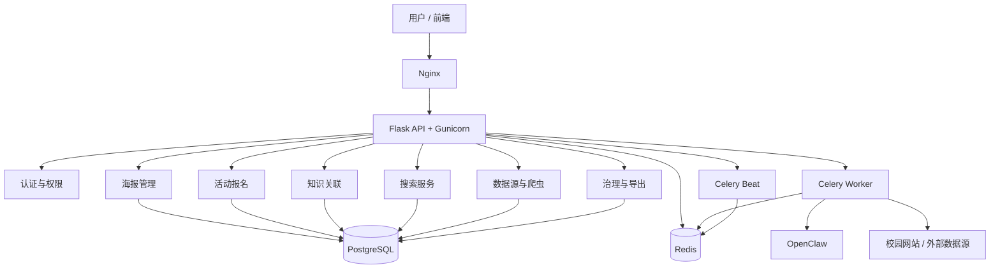
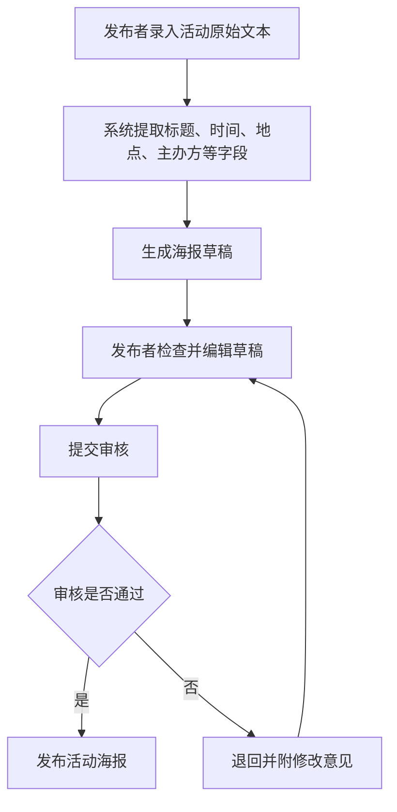
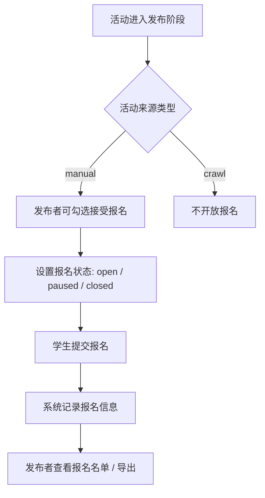
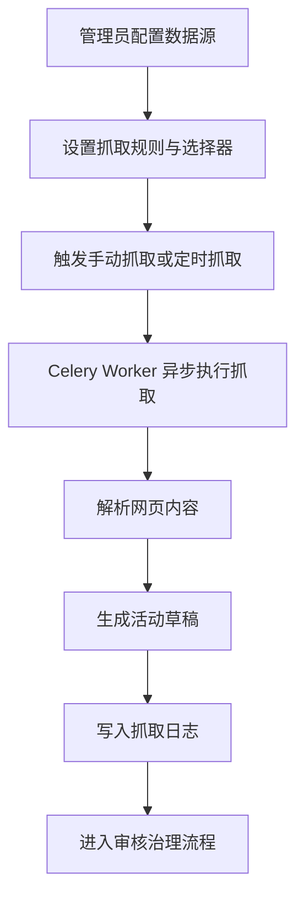
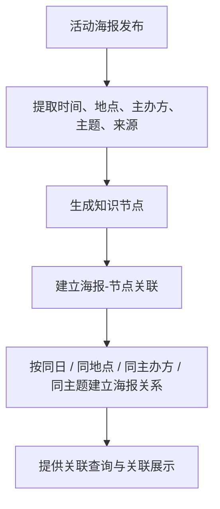
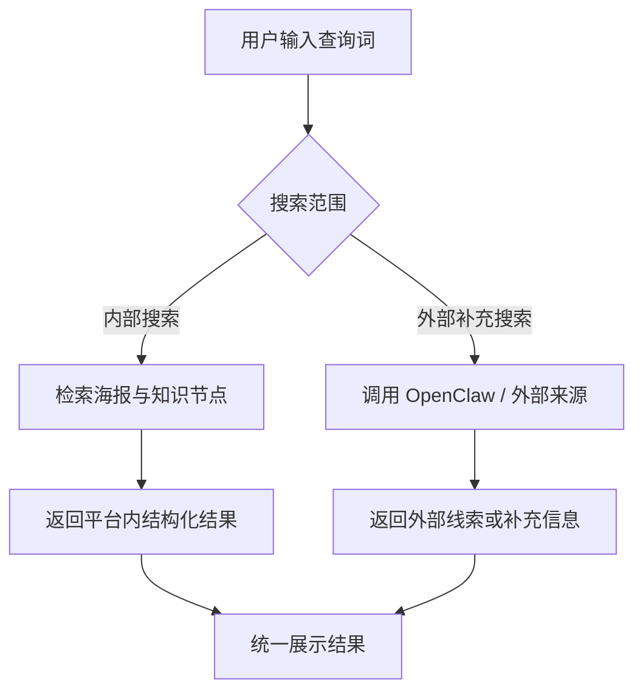
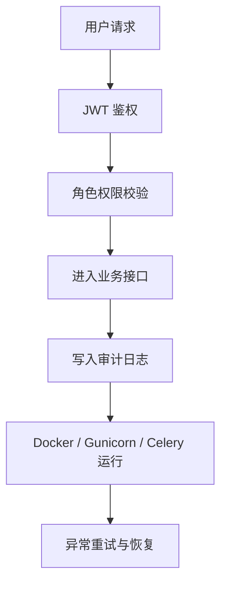

# 开题报告后端关系图

这个文件用于集中放置开题报告可直接截图使用的 Mermaid 图。

当前建议保留：
- 1 张总体架构图
- 各模块流程图

不再单独使用“模块-架构映射图”。

---

## 1. 后端总体架构图

用途：
- 放在“后端总体架构”页
- 讲接入层、API 层、任务层、数据层和外部能力层

讲解要点：
- 用户请求先经过 Nginx，再进入 Flask API。
- API 负责统一业务入口，Celery 负责异步任务解耦。
- PostgreSQL 保存核心业务数据，Redis 负责缓存和任务队列。
- OpenClaw 和外部网站属于扩展能力，不影响主流程独立运行。

可直接口头表述：
“这张图展示的是后端总体架构。最上层是用户和前端请求，通过 Nginx 进入 Flask API。中间是我们的核心业务模块，下面是 PostgreSQL 和 Redis 组成的数据与任务支撑层。对耗时操作，比如抓取和复杂处理，我们交给 Celery 执行，这样同步接口不会被阻塞。右下角的 OpenClaw 和外部数据源是扩展能力，主流程即使不依赖它们也可以运行。”

---

## 2. 海报管理模块流程图

用途：
- 放在“海报模块”讲解页或“核心业务流程”页左侧
- 突出草稿、审核、发布闭环

讲解要点：
- 海报模块不是直接发布，而是先生成草稿。
- 发布者有编辑确认环节，管理员有审核环节。
- 整个模块强调“可控发布”，而不是自动上架。

可直接口头表述：
“海报管理模块的核心是一个草稿到发布的闭环。发布者先录入原始文本，系统提取关键字段并生成海报草稿。草稿不是直接发布的，发布者还可以进行修改，然后再提交审核。审核通过后才正式上线，不通过就退回修改。这样做是为了保证活动内容的规范性和可信度。”

---

## 3. 活动报名模块流程图

用途：
- 放在“活动报名模块”页
- 突出业务规则：爬取活动不可报名，手动活动可报名

讲解要点：
- 报名不是所有活动默认都开放。
- 只有手动发布活动才能开启报名。
- 发布者不仅能开关报名，还能查看和导出报名名单。

可直接口头表述：
“报名模块最关键的规则是区分活动来源。对于手动发布的活动，发布者可以勾选接受报名，并设置报名状态，比如开放、暂停或关闭。学生报名后，系统会记录报名信息，发布者可以查看名单和导出结果。而爬取活动只做展示，不开放报名，这样可以避免对来源不明确或未经人工确认的活动开放运营入口。”

---

## 4. 数据源与爬虫模块流程图

用途：
- 放在“数据源与爬虫模块”页
- 强调异步执行、草稿入库、日志留痕

讲解要点：
- 爬虫模块是“抓取并生成草稿”，不是“抓取即发布”。
- Celery 异步执行是这里的工程重点。
- 抓取日志保证问题可排查、过程可追踪。

可直接口头表述：
“数据源与爬虫模块的目标是把外部校园网站的信息转成平台内部的活动草稿。管理员先配置数据源和抓取规则，然后系统通过 Celery 异步执行抓取和解析，避免阻塞接口请求。抓到的数据不会直接上线，而是先生成草稿并写入抓取日志，再进入后续审核治理流程。”

---

## 5. 知识关联模块流程图

用途：
- 放在“知识关联模块”页
- 强调关系是可解释的，不是黑盒推荐

讲解要点：
- 知识关联来源于结构化字段，不是纯黑盒算法。
- 关系建立规则清晰，比如同日、同地点、同主办方、同主题。
- 重点是“解释为什么相关”。

可直接口头表述：
“知识关联模块的作用，是把单条活动扩展成可解释的关联网络。系统先从活动中提取时间、地点、主办方、主题和来源，再生成知识节点，并按同日、同地点、同主办方、同主题等规则建立关系。这样用户看到的不只是推荐结果，而是能理解‘为什么相关’。”

---

## 6. 搜索模块流程图

用途：
- 放在“搜索模块”页
- 强调内部检索与外部补充搜索并存

讲解要点：
- 搜索分为内部搜索和外部补充搜索。
- 内部搜索面向平台已有数据，外部搜索面向新增线索。
- 最终展示时强调结果来源区分。

可直接口头表述：
“搜索模块不是只有一个简单搜索框，而是分成两类能力。内部搜索主要针对平台已有的海报和知识节点，帮助用户快速定位；外部补充搜索则用于发现平台外的新线索或补充来源信息。这样设计可以兼顾平台内的数据利用和平台外的信息扩展。”

---

## 7. 安全与运维流程图

用途：
- 放在“安全与运维”页
- 强调系统不仅有业务逻辑，也有工程保障

讲解要点：
- 每个请求都要经过鉴权和权限校验。
- 关键业务操作要留审计日志。
- Docker、Gunicorn、Celery 保证系统可部署、可恢复。

可直接口头表述：
“这张图主要说明后端不只是实现业务逻辑，也考虑了工程保障。用户请求首先经过 JWT 鉴权和角色权限校验，进入业务接口后关键操作会记录审计日志。系统运行层面采用 Docker、Gunicorn 和 Celery 组合，保证服务能稳定部署，并具备基本的异常恢复能力。”

---

## 8. 使用建议

- 页 4：截图“后端总体架构图”
- 页 5：根据你想重点讲的模块，选 2-3 张模块流程图
- 页 6：主图可继续使用 `activity.png`，若想更贴合当前设计，则换成“海报管理模块流程图 + 活动报名模块流程图”
- 页 7：主图用 `class.png`，右侧补“安全与运维流程图”

推荐最省事组合：
- 页 4：总体架构图
- 页 5：海报管理模块流程图
- 页 6：活动报名模块流程图 + 数据源与爬虫模块流程图
- 页 7：`class.png` + 安全与运维流程图
