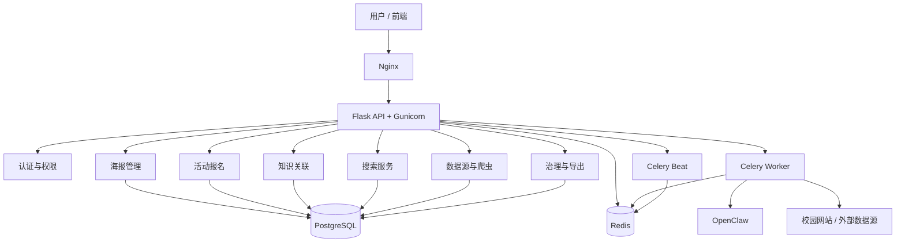
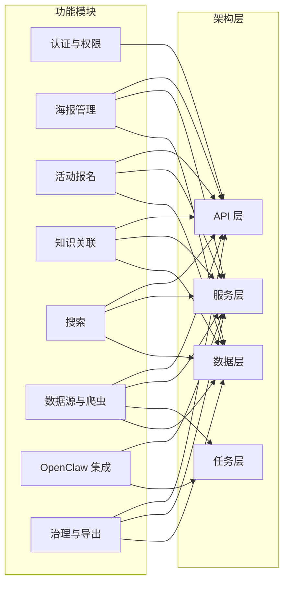
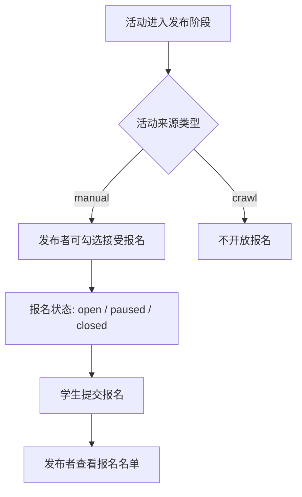

# 开题报告（后端主讲）讲稿与配图方案（Markdown / 现有图版）

## 一、汇报结构建议（总时长 7-8 分钟）

- 页 1：封面（20s）
- 页 2：背景与需求（占位，35s）
- 页 3：后端目标与边界（55s）
- 页 4：后端总体架构（70s）
- 页 5：后端模块全景（80s）
- 页 6：核心业务流程（75s）
- 页 7：数据模型 + 接口 + 安全运维（75s）
- 页 8：进度计划与总结（40s）

总计约 450 秒（7 分 30 秒）。

---

## 二、7-8 分钟讲稿（后端重点版）

### 页 1：封面（约 20 秒）
各位老师好，我们是校园活动信息平台项目组。今天我主要汇报后端部分，核心会讲三件事：我们后端要解决什么问题、采用了怎样的技术架构、以及当前阶段如何保证可实现和可演示。

### 页 2：背景与需求（占位，约 35 秒）
项目背景是校园活动信息分散、格式不统一、检索效率低。需求上，我们希望后端先完成“可采集、可治理、可发布、可检索”的闭环，前端体验和高级智能能力后续迭代。换句话说，先把数据和流程打通，再做交互和增强功能。

### 页 3：后端目标与边界（约 55 秒）
后端目标有四点。第一，统一 API，前后端和脚本都走同一接口。第二，活动数据闭环可追踪，从来源到审核到发布状态都有记录。第三，支持海报化表达和报名业务。第四，保留可扩展能力，后续接入更强检索和 AI 增强。
边界也很明确：本阶段优先完成基础后端闭环，不追求复杂报名流程、不追求完整推荐系统、不把高成本 AI 推理作为硬交付。我们通过边界控制，保证开题之后能按里程碑落地。

### 页 4：后端总体架构（约 70 秒）
架构采用分层设计：接入层是 Nginx；API 层是 Flask + Gunicorn；任务层是 Celery Worker/Beat；数据层是 PostgreSQL + Redis；外部能力层接 OpenClaw 和校园网页数据源。整体通过 Docker Compose 编排。
这种设计的价值是：同步请求和异步任务解耦、业务层与数据层职责清晰、部署方式一致。对于课程项目来说，既能保证可运行，也便于后续扩展和排障。

### 页 5：后端模块全景（约 80 秒）
后端主要模块包括：
1. 认证与权限：JWT 登录鉴权和角色控制。
2. 海报管理：活动文本抽取、海报草稿生成、审核发布流转。
3. 活动报名：发布者可勾选“接受报名”，可查看报名名单并控制报名开关。
4. 知识节点与关联展示：按时间、地点、主办方、主题建立可解释关联。
5. 搜索模块：内部检索 + 外部补充搜索。
6. 数据源与爬虫：配置来源、抓取解析、草稿入库、日志留痕。
7. OpenClaw 集成：负责复杂抽取和扩展搜索能力。
8. 治理与导出：去重、质量评分、审计日志、统计导出。
其中有一个关键规则：爬取活动默认不开放报名，报名仅针对人工发布活动。

### 页 6：核心业务流程（约 75 秒）
核心流程是：数据源配置 -> 抓取解析 -> 草稿入库 -> 审核治理 -> 发布上线 -> 检索与导出。
人工发布活动在发布时可开启报名，报名状态可在 open、paused、closed 之间切换，发布者可查看已报名名单。爬取活动只做展示和治理，不开放报名入口。这条规则把“信息采集活动”和“运营型活动”清晰区分，降低业务风险。
流程的本质是把静态通知转成结构化活动对象，再通过审核、关联和检索形成可持续运营的数据闭环。

### 页 7：数据模型 + 接口 + 安全运维（约 75 秒）
数据模型方面，核心实体是 `posters`、`knowledge_nodes`、`poster_node`、`poster_links`、`data_sources`、`crawl_logs`，后续报名可扩展 `poster_registrations`。这些表支撑活动内容、关联关系、来源追溯和治理记录。
接口方面，重点包括：认证接口、海报 CRUD、审核接口、关联查询、数据源抓取、任务状态查询、导出接口。
安全与运维方面，采用 JWT 鉴权、角色权限控制、审计日志、容器化部署、异步任务隔离与重试机制。整体目标是“可追踪、可恢复、可演示”。

### 页 8：进度计划与总结（约 40 秒）
当前阶段目标是完成基础后端闭环和稳定部署：接口可用、流程贯通、数据可追踪。下一阶段按优先级推进前后端联调、报名体验完善和高级智能能力接入。总结来说，后端策略是先建稳定骨架，再做能力增强，确保项目能按课程节奏持续交付。

---

## 三、配图策略（不使用 PaperBanana）

### 总体原则

- 优先复用仓库内已有图：`activity.png`、`class.png`、`usecase.png`
- 新增内容优先使用 Mermaid / Markdown 关系图
- 开题报告中不追求“视觉炫技”，而追求“结构清晰、逻辑自洽、便于讲解”

### 图与页面对应建议

- 页 4（后端总体架构）：
  - 优先：使用 Mermaid 新画“总体架构图”
  - 备选：无
- 页 5（后端模块全景）：
  - 优先：Mermaid 模块-架构映射图
  - 备选：`usecase.png` 辅助说明角色与功能
- 页 6（核心业务流程）：
  - 优先：现有 `activity.png`
  - 备选：在 Mermaid 中补“报名规则分支”
- 页 7（数据模型 + 接口 + 安全运维）：
  - 优先：现有 `class.png`
  - 备选：Mermaid 补一张三列信息结构图
- 附录 / 备用页：
  - `usecase.png`

---

## 四、现有图使用建议

### 1. `docs/activity.png`

用途：放在“核心业务流程”页。

讲解方式：
- 用它说明“海报草稿 -> 审核 -> 发布”的主闭环。
- 口头补一句：当前新增业务规则是“手动发布活动可报名，爬取活动不可报名”。
- 如果时间允许，可在 PPT 上手动加一个文本框标注报名分支。

### 2. `docs/class.png`

用途：放在“数据模型 + 接口 + 安全运维”页的左半区。

讲解方式：
- 重点只讲 `Poster`、`KnowledgeNode`、`PosterLink`、`DataSource`、`CrawlLog` 这几类核心对象。
- 再补一句：后续报名功能可新增 `poster_registrations` 作为扩展实体。

### 3. `docs/usecase.png`

用途：可放“模块全景”页或附录。

讲解方式：
- 用来说明三类角色：浏览用户、发布者、管理员。
- 强调发布者新增能力：为手动发布活动开启报名、查看报名名单。

---

## 五、建议新增的 Mermaid 图

下面三张图最值得补，且都可以直接在 Markdown / Mermaid 编辑器里生成。

### 图 A：后端总体架构图（建议用于页 4）

讲解重点：
- API 统一入口
- 业务服务集中在 Flask 后端
- Celery 负责异步任务
- PostgreSQL/Redis 分别负责持久化与任务缓存

### 图 B：模块-架构映射图（建议用于页 5）

旁边建议加一句人工说明：
- `手动发布活动可开启报名`
- `爬取活动不可报名`

### 图 C：报名规则补充流程图（建议作为页 6 的右侧小图）

讲解重点：
- 报名不是所有活动都有
- 只有人工发布活动支持报名
- 发布者能查看报名名单和控制报名状态

---

## 六、页面级配图落地方案

### 页 3：后端目标与边界

建议不用复杂图，直接用左右对照文本框即可：
- 左：目标
- 右：边界

### 页 4：后端总体架构

建议使用“图 A：后端总体架构图”。

### 页 5：后端模块全景

建议左侧放“图 B：模块-架构映射图”，右侧放 3 行规则说明：
- 手动发布活动可报名
- 爬取活动不可报名
- 模块通过统一 API 和数据层协作

### 页 6：核心业务流程

建议主图用 `activity.png`，右下角补“图 C：报名规则补充流程图”。

### 页 7：数据模型 + 接口 + 安全运维

建议左侧放 `class.png`，右侧用项目符号总结：
- 数据模型：Poster / KnowledgeNode / DataSource / CrawlLog
- 接口分组：auth / posters / review / search / tasks / export
- 安全运维：JWT / RBAC / 审计日志 / Docker / Celery

---

## 七、建议保留的“目标态”内容

虽然不用 PaperBanana 画高级能力图，但开题里仍建议口头提一句后续方向：

- 智能海报优化
- 语义检索与推荐
- 自动标签生成
- 跨源融合与可信度评分

表达原则：
- 这些是“下一阶段目标”
- 不是“当前已实现能力”

---

## 八、最终建议

如果你赶时间，最省力且效果稳定的组合是：

1. 页 4：Mermaid 总体架构图
2. 页 5：Mermaid 模块-架构映射图
3. 页 6：直接用 `activity.png` + 小的报名规则流程图
4. 页 7：直接用 `class.png`

这样做的好处：
- 不依赖外部图片生成
- 和后端技术文档高度一致
- 非常适合开题报告这种“讲逻辑与方案”的场景
